# Installing Loop
You’re ready to get to the real stuff now, right?  Excited to get Looping?  Let’s do it.  Let’s put that Loop on your iPhone.

## Setup your Apple Computer

### Install XCode
Did you go to the [Apple App Store](https://developer.apple.com/xcode/)? It’s an application on your Apple Computer.  Open it and search for XCode.  Download and install it for free.  Easy peasy.  Except it takes about 20-40 minutes to download depending on your internet speed.

### Install Carthage
The installation of Carthage has a few different ways it can be done, but the easiest is to download the Carthage package here:

[Carthage.pkg download](https://github.com/Carthage/Carthage/releases/download/0.18.1/Carthage.pkg)       

Double-click on the download and follow the directions to install (basically give your computer’s password and it does the rest).  Done.  Nothing more needs to happen with Carthage (it runs in the background).

IF you have problems with that method, you can use the “Homebrew method”.  And here’s how it is done:
Open the Terminal application on your Apple computer (it is located in the Utilities application folder)

Copy and paste the line below into the prompt in Terminal.  Press return after you paste it in.

`/usr/bin/ruby -e "$(curl -fsSL https://raw.githubusercontent.com/Homebrew/install/master/install)"`

There will be a prompt asking if you want to continue (press return to continue, then it may prompt for your password.  enter your computer user password.).  Wait while the script does its thing...you’ll see info scroll by and then it will pause for awhile.  Eventually, it will be done and you’ll see something that says “Installation successful” and you’ll have a ready terminal prompt again.

Type `brew update` and press return.

Type `brew install carthage` and press return.

You can close the Terminal application now.  You’re done with it.  Phew.

## Download Loop Source Code
You’ll need to obtain the Loop’s source code in order to build the app on your computer.  There are various ways of doing that; from super easy to more advanced. Pick whichever method you are comfortable with.  The first two options do not require a GitHub account.  The last option will require you to have a GitHub account.

{Note: What’s the disadvantage of the Super Easy option below?  Any customizations you do in XCode will remain on your local computer only.  If Loop’s source code updates to a new version, you will have to re-enter your customizations if/when you decide to update your Loop to subsequent versions.  However, most customizations are probably going to be fairly quick and easy to redo, just like they were the first time.}

### Direct Download (Super Easy)

If you click on the link below, a copy of the Loop source code’s master branch will be downloaded to your downloads folder.

[Loop Master branch](https://github.com/LoopKit/Loop/archive/master.zip)

### Clone with Terminal (Sorta easy)

Open Terminal Application, copy and paste the line below.  This will download a clone of the master branch to your root directory of your computer user account:

`git clone https://github.com/LoopKit/Loop.git`

### GitHub Desktop, Fork and Pull the Repo (Advanced)

Login to your GitHub account and fork a copy of the [Loop repository](https://github.com/LoopKit/Loop).  

Setup a sync between your GitHub repository and your computer by installing [Github Desktop](https://desktop.github.com/) onto your computer.

Go back to your Loop repository in GitHub and press the green “Clone or download” button and choose “open in desktop”.  You will now have a copy of the selected branch in stored in your local folder.  

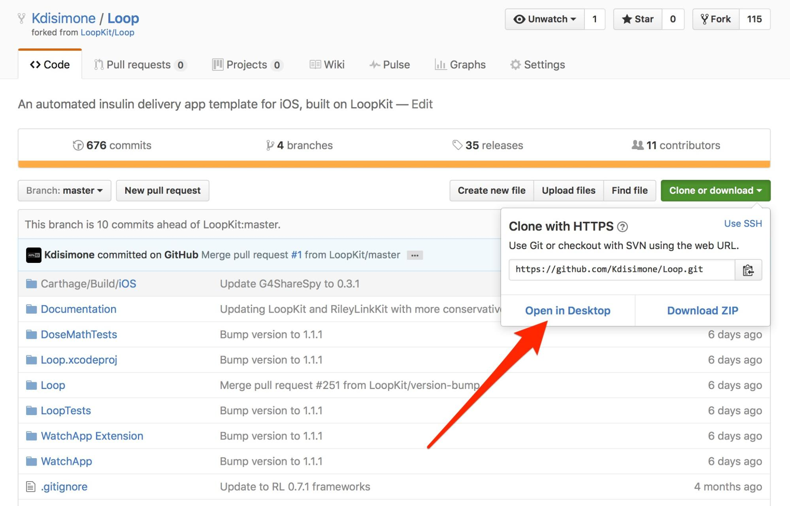

You can later go into the GitHub desktop client and commit your changes, change branches, etc as you test various configurations.  See Section 4.3.6 for further information about how to commit those changes back to your repository.

## Install Loop using XCode

Here’s where the fun really begins.  You’re about to build your Loop app.

If you’ve used the direct download option (super easy), go to your Downloads folder, open the Loop folder, and double click on Loop.xcodeproj.  

If you used another option, find the Loop folder on your computer and double click on Loop.xcodeproj

A warning may appear asking if you really want to open it, click Open.  XCode will open the project, and take a few moments to organize the files.

Once XCode has finished indexing, the Loop project will appear in the far left column.  Click on the blue Loop icon, and then click on the file called Loop.xcconfig.  The middle portion of XCode window will populate and this is where you will find the MAIN_APP_BUNDLE_IDENTIFIER. The default is com.loopkit 

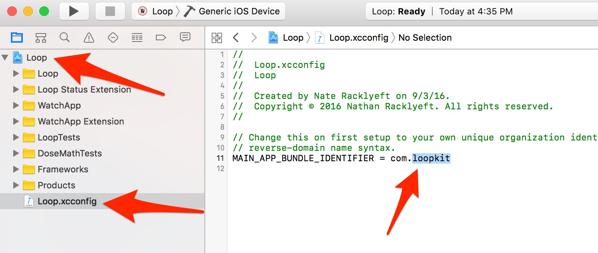

You need to change the MAIN_APP_BUNDLE_IDENTIFIER  to your own unique identifier.  Keep it in the reverse-domain syntax, meaning start with “com.” (no quotes though).  After you enter your new MAIN_APP_BUNDLE_IDENTIFIER, save the project using Command-S, and then click on the blue “Loop” file in the far left column.

The next steps are to “sign” the application so that Apple will allow its use on the iPhone.  You will need to select a “team”.  If you already have a team from previous XCode projects, you may see teams listed.  Use the dropdown menu to select the appropriate team.  Make sure you keep the “automatically manage signing” box checked.  

If, however, this is your first time signing an app in XCode, your screen may instead look like the screen to the right.  In which case, you will need to add a developer account (either free or paid) by clicking on “Add Account”.  

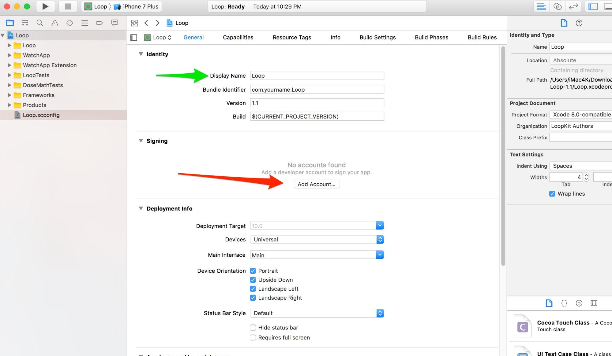

“Add Account” will open the XCode preferences window, as shown below.  You will need to sign in with your Apple ID (or create one, if you don’t already have one).

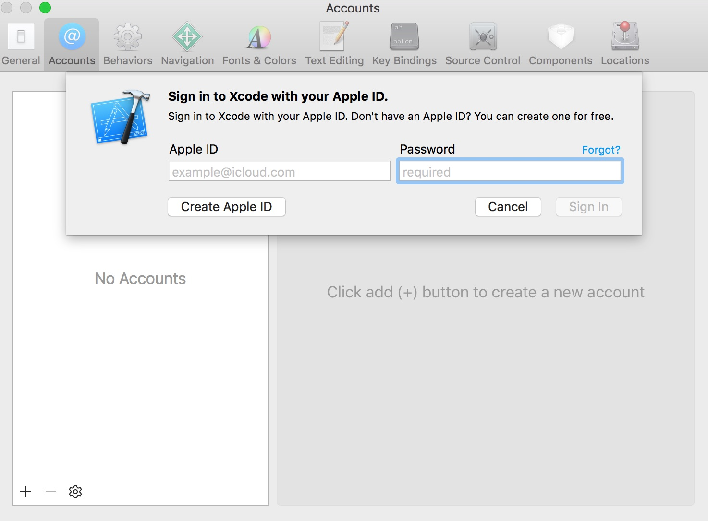

Once you get signed in, your apple ID will appear under the Accounts section as shown below.  Close that window by pressing the little red circle in the upper left corner, and you will return to the main XCode screen again.

Note: You may need to close Xcode and restart to see your Apple account for signing to appear in the Signing section.

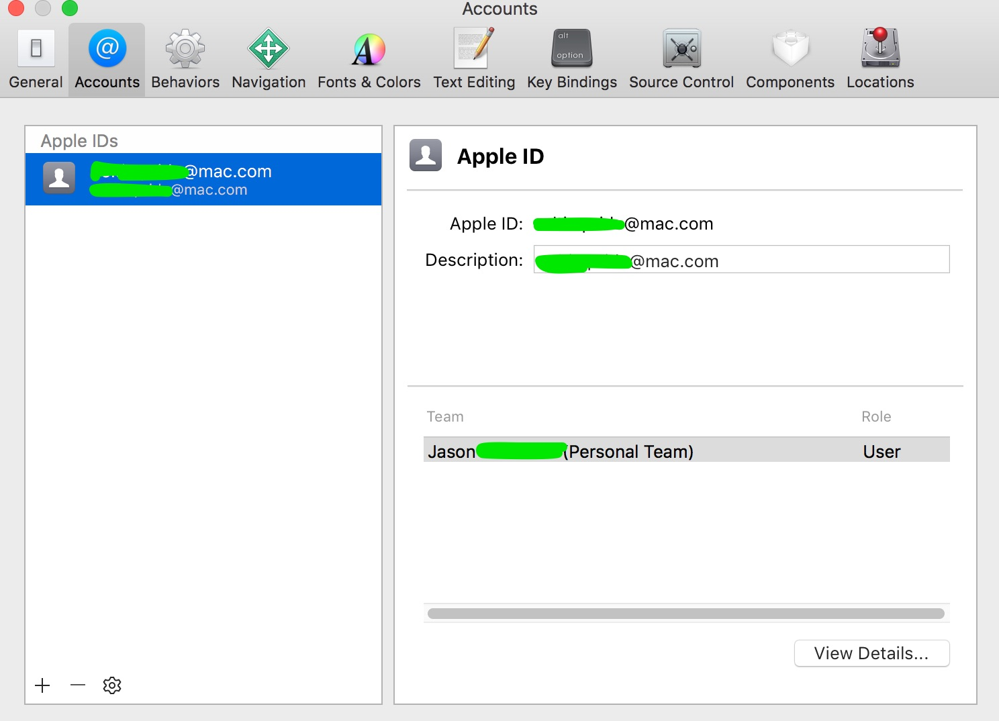

********************************

<b>Beginning of SIDE NOTE about signing and Provisioning Profiles.</b>

The 7-day free Provisioning Profiles are signed from “(Personal Team)”.

The full-year paid Provisioning Profiles do NOT have “(Personal Team)”

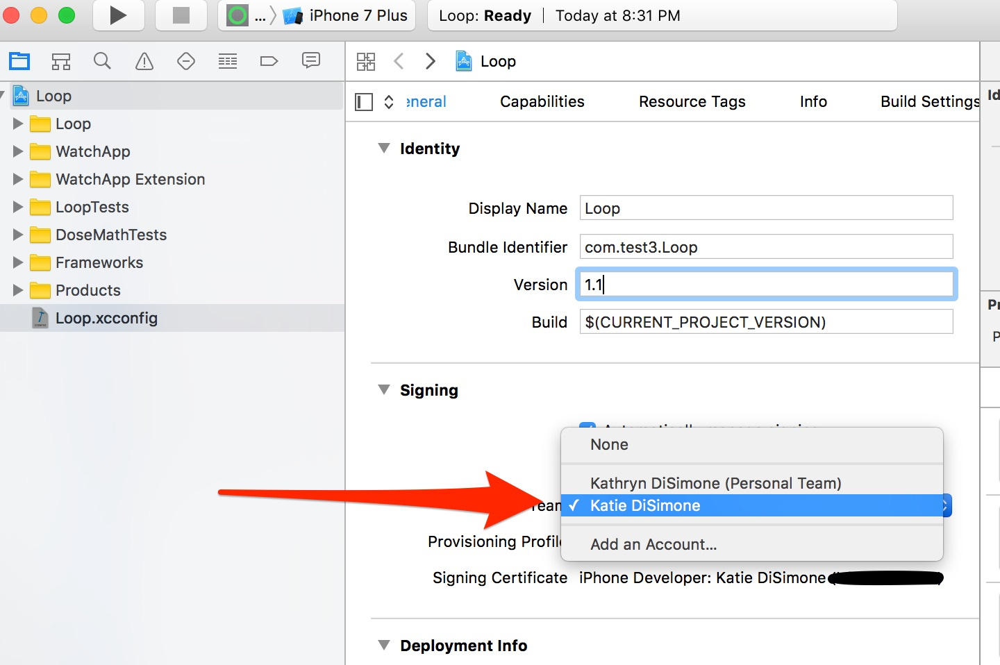

Many people think “Hey I’ll try to build this Loop for free and if I like it, then I’ll buy the $99 Apple Developer license.”  If that’s you right now, please come back here when you are ready to reinstall as a paid developer account.  You will need to: 

* Select the correct team because now there will be two to choose from.  Use the one without the “(Personal Team)” to build apps that last a full 12 months.
* When you rebuild your app, choose a new MAIN_APP_BUNDLE_IDENTIFIER different than your previous one.  For example, if you used “com.yourname” on the free app then choose “com.yourname2” for the new paid app.  
* You will have to re-enter your Loop settings on your new app once it is installed (hopefully, you took written notes of them from when you were running your free app..hint hint).

<b>End of SIDE NOTE</b>
********************************

When you return to the main screen, select your team name and you may see two status warnings.  The first warning may appear if you do not have an iPhone plugged into the Mac.  The “failed to create a provisioning profile” has details that should alert you to plug in your device (iPhone).  Once you connect your iPhone via cable to the Mac, select your iPhone from the hidden drop down list (see red arrow below).  Your device’s personal name should be at the top of the list.  Select your personal device. You may need to “register the device” if this is your first time using Xcode with that iphone, follow the prompt if that’s the case.

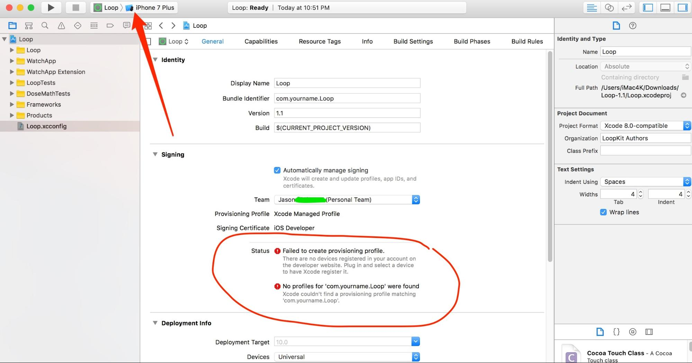

Once you select your device, XCode should resolve the warnings and generate a Provisioning Profile.  If you click on the information icon (little “i” in the circle), for the Provisioning Profile, you can verify the signing date and mark your calendar for rebuilding in 7 days if you are using a free Apple Developer account.  If you are enrolled in the Apple Developer Program (aka paid the $99), the expiration date will be for a year from the creation date.

Finally, you need to make sure to sign all FOUR “targets” to the application; Loop, Loop Status Extension, WatchApp, and WatchApp Extension.  So far, we have only signed the Loop target.  Click on the blue “Loop” on the left and then the box with the vertical line to drop down the targets list.  Choose each of the remaining three targets and then select the signing team that you selected previously in the Loop target signing. Make sure you have signed all four targets.  If the “loopkit” still appears on the Bundle Identifier line, don’t worry about it.  Xcode will update that to your chosen MAIN_APP name when it builds.  Sometimes Xcode is just slow to rename.  Just leave that Bundle Identifier line untouched.

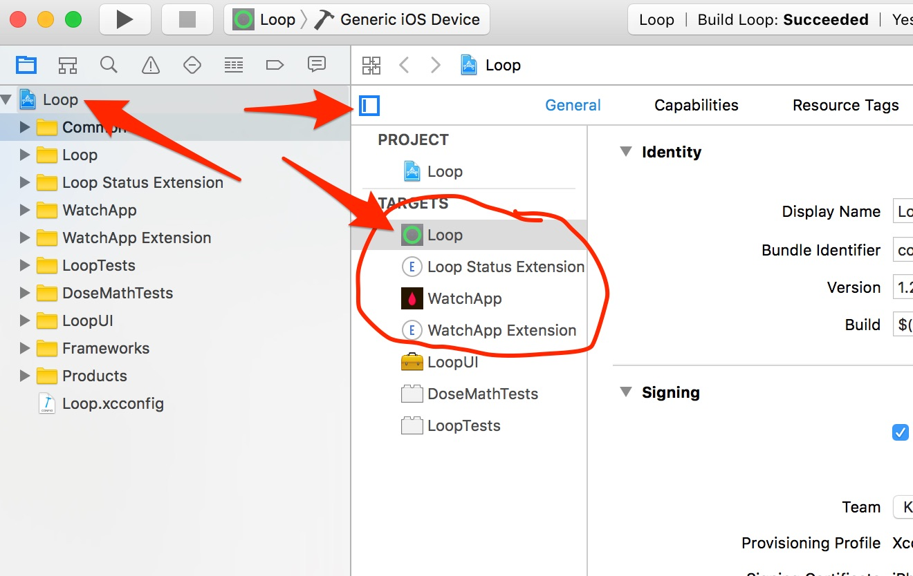

********************************
<b>At this point in the process, you should make any custom configurations to your Loop app before you finish with the installation of Loop on your iPhone.  If you want to make any of the customizations yourself, the step-by-step instructions are provided below (or by clicking on the link to the left).  When you’ve completed those customizations, please return here and follow the next steps to finish the installation of Loop.</b>
********************************

All done with customizations? Let’s finish the installation of the Loop app onto your iPhone.  Select your device and then press the “play” button (or build button) to start XCode on its way.  [You may be prompted to add the iPhone to your Developer Account...go ahead and do so.]  You’ll see the progression of the build in the status window.  If the build is successful, it will say “finished running Loop” in the status bar.  If the build fails, it will show you red error alerts and you can read what the failure was.  Yellow error alerts do not cause the build to fail, those are just warnings.

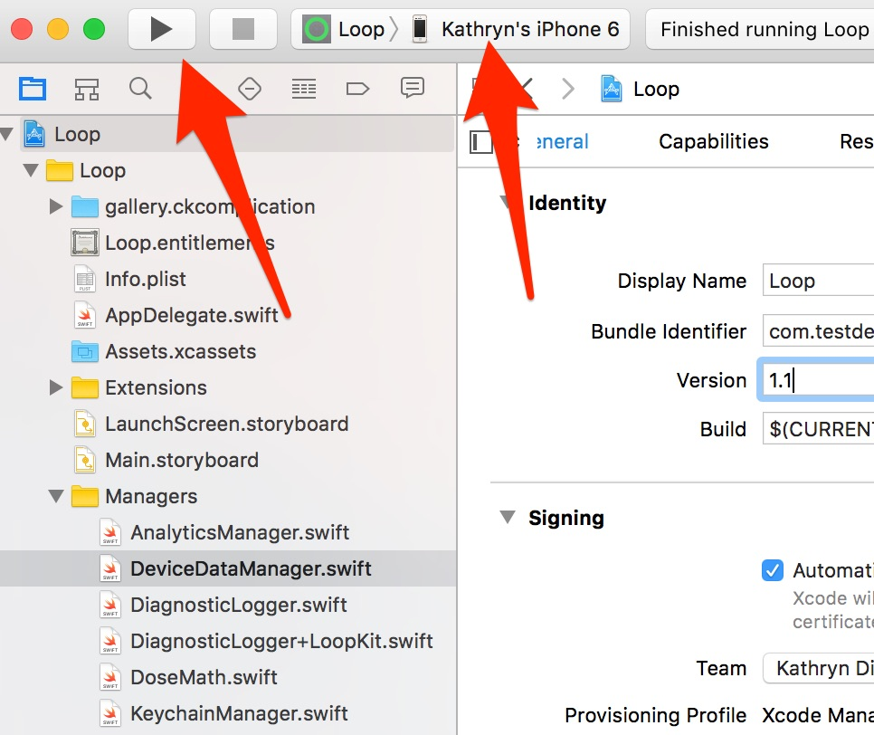

If this is the first time you have installed an app on your iPhone using your Developer Account, you may get a warning like this.  Just follow the directions in the warning, and the issue resolves very quickly.  Click ok and you can safely disconnect your iPhone from the computer.  (If you don’t get a warning and the Loop app installs but does not open, you may still need to go to Settings->General->Device Management and enable trust for your Developer Account.)

You can confirm Loop has installed on your phone simply by looking on the iphone.  Turn it on and check if the Loop app is running, or locating the Loop app icon.  If you don’t see it, try pressing the build (play) button again.  There should be a message at the top of Xcode window indicating a successful build.  Once you get confirmation and can see Loop on your iPhone, you can simply unplug from computer.  

CONGRATS!  YOU JUST INSTALLED LOOP!

...

## Code Customizations
Based on Loop users’ experience, there are some customizations that you may want to incorporate ahead of building your Loop app.  These customizations must be done prior to building the Loop app onto your iPhone, they cannot be done from within the app itself.

<b>[Note: To help you find the Line numbers in XCode, it may be helpful to turn them on now.  Go to XCode Preferences, under Text Editing, click the box to Show Line Numbers.  Every effort will be made to update the line numbers as the code is updated periodically, but there may be times where the screenshots and line numbers are slightly different than the current version of Loop code.]</b>

### Default Carb Absorption Times

Loop’s default carb absorption times are based on the high, medium, and low glycemic index absorption curves presented in <i>Think Like A Pancreas</i> by Gary Scheiner.  Currently the lollipop icon is set for 120 minutes, taco icon for 180 minutes, and pizza icon for 240 minutes.  These default values may not work for everyone, you will need to find what works for you.

You can modify these defaults to suit your needs, however it would be best to test your own carb absorption patterns before necessarily adjusting the defaults.  You can always modify these after you’ve had some Loop experience and simply reinstall the Loop.  (after all, you’re a pro at that now)  Section 6 provides some examples of analyzing meal and Loop behaviors to determine if your carb absorption times are accurate.

If you would like to modify those defaults, you can do so in the DeviceDataManager.swift Line 1040.  Note, the times are in hours, not minutes, in the code.

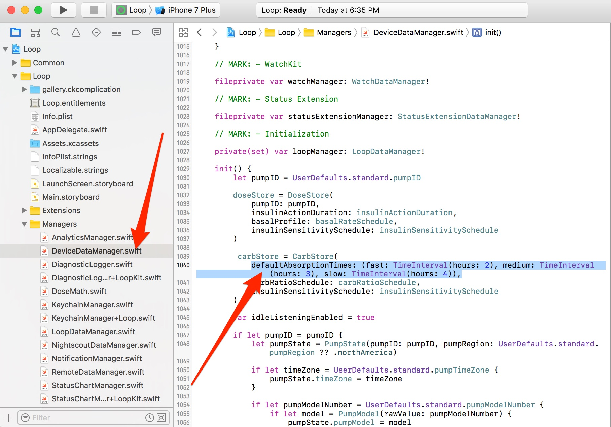

### Loop Logo
If you want an app logo other than the default green circle for your Loop app, you can easily customize this.  To make it easy to generate the correct sizes of icons, you can use a site like [appicon.build](http://www.appicon.build/) and just drag and drop your source image. The site will email you a zip file.  Double click the zip file, choose the “ios” folder, and copy the contents of the Appicon.appiconset as shown highlighted below.

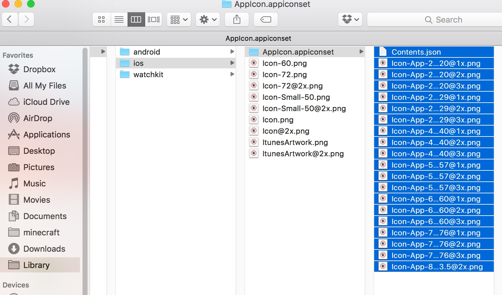

Now navigate to the corresponding Loop folder as shown below.  Replace the contents of the Appicon.appiconset with your copied images.

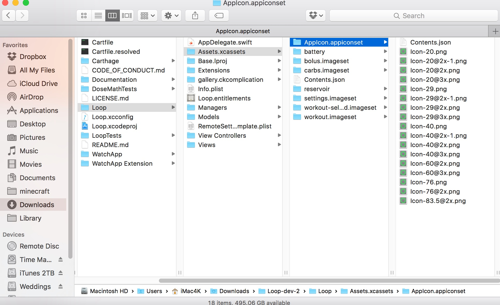

You can confirm the successful change by looking in XCode.  You should see your custom logo in the Appicon set now.  You will also likely see a yellow alert that there are “5 unassigned children”.  This alert will not prevent your app from building, it’s simply because the zipfile contained more sizes of images than Loop app uses.  You can just leave the unassigned images as is. 

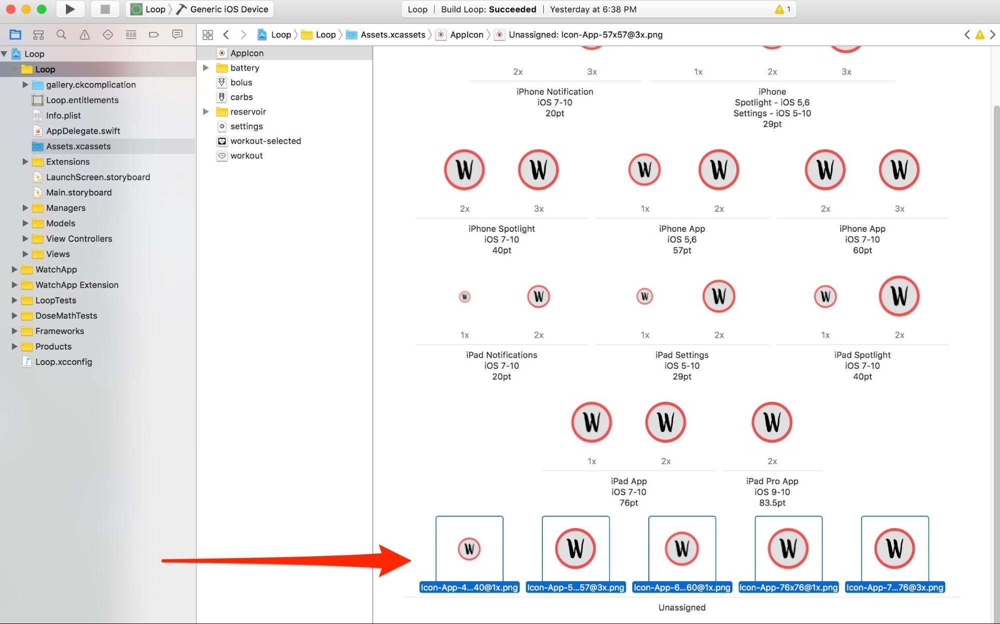

### Loop Graph hours
If you want the Loop’s graphs to display different time length than the default, you will go to the StatusTableViewController.swift line 181. This code keeps track of how many hours to display in total and how far into the future to display on your graphs. For total hours it does a calculation based upon your screen size and how granular to display between each segment. For how far forward to display, it currently uses your Insulin Action Duration setting to determine this (and if that number is missing for some reason it defaults to 4 hours). 

Please note, using this will make it more difficult to see changes in other charts on your screen (like length of temp basal).

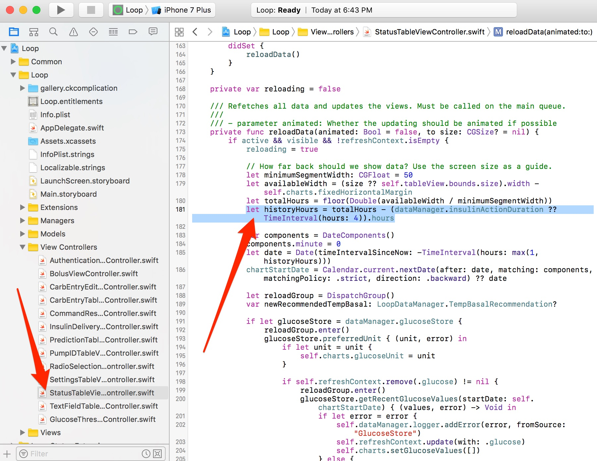

Here are a couple of ways you could modify line 181 based on your specific wants:

Want double the amount of total hours shown?
`let historyHours = (totalHours * 2) - (dataManager.insulinActionDuration ?? TimeInterval(hours: 4)).hours`

Want 1/2 of my Insulin Action Duration to show in the future?
`let historyHours = totalHours - ((dataManager.insulinActionDuration / 2) ?? TimeInterval(hours: 4)).hours`

Want 2.5 x the total time and only 2 hours forward within that?
`let historyHours = (totalHours * 2.5) - (TimeInterval(hours: 2)).hours`

### Workout Range Duration

If you’d like more than just the standard 1 or 2 hour duration for the Workout Range, you can add or modify the code to add another time interval or edit the existing ones.

Go to the Loop>>Extensions>>UIAlertController.swift and modify Line 30.  The default has 1 and 2 hours as shown where the arrow is pointing in the screenshot.  You can edit those to whatever duration you want (in units of hours) and add a duration if you prefer.  If you’d like 1, 2, and 3 hours options...simply edit the numbers in the brackets to read [1, 2, 3]. It is possible to enter less than 1 hour intervals such as 15min, 30 min, 45 min by editing the brackets to read [0.25, 0.5, 0.75].

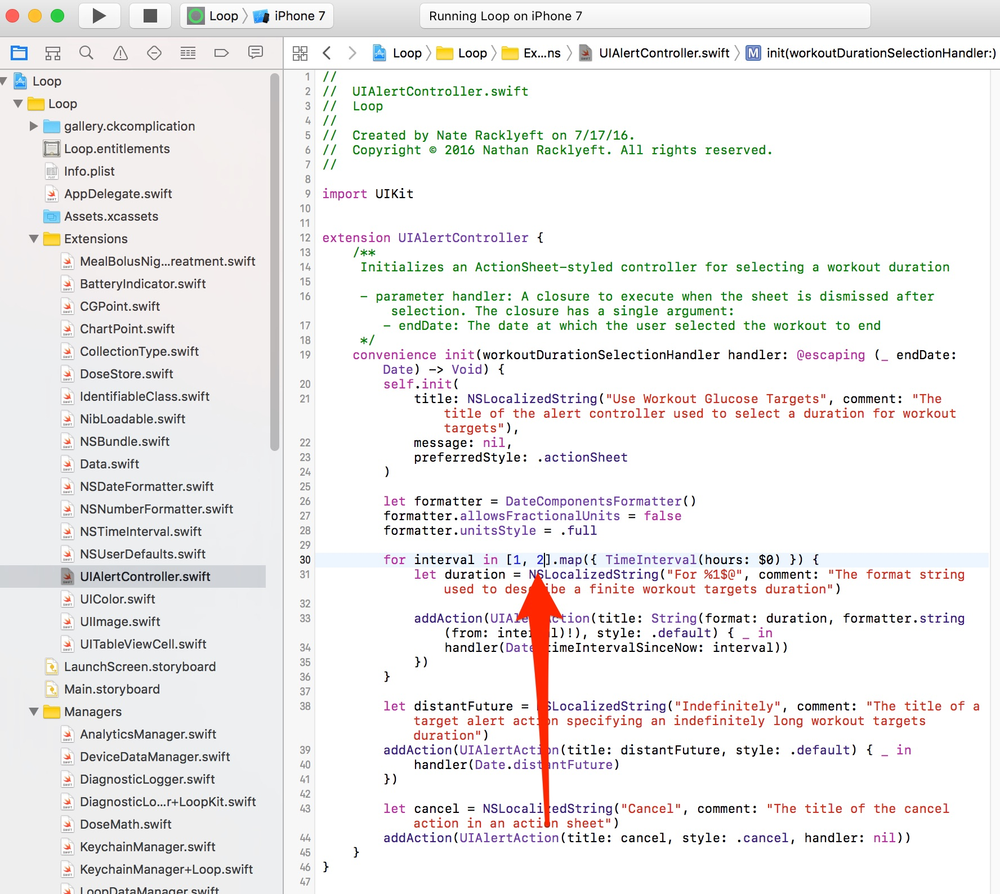

### Apple Watch Customizations

#### Recommended Bolus Autofill
The Apple Watch's default is to autofill to 75% of the recommended bolus.  If you wish, you can customize so that the watch autofills a different percentage. To do this, the multiplier can be changed from 0.75 to a value of your choice. A value of 1 will autofill 100% of the recommended bolus. A value of 0 will autofill 0% of the recommended bolus.   Go to the Loop Watchapp Extension Folder, within that go to the controllers folder, within that go to BolusInterfaceController.swift. Edit the section of line 97 as indicated on the picture below.

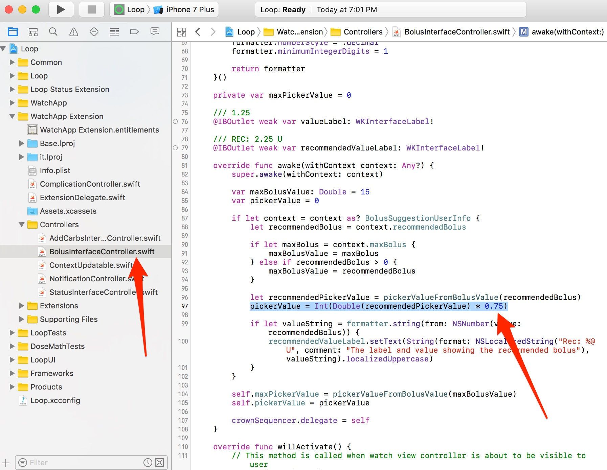

#### Adjust sensitivity of digital crown for carb and bolus entry
The rate of change of the carb and bolus entry pickers when using the digital crown can be altered. Navigate to the WatchApp Extension folder and within that the Controllers folder. Edit line 130 of AddCarbsInterfaceController.swift and line 161 of BolusInterfaceController.swift. The 1/24 value is the ratio of rotations of the crown to the amount of change in the value. Changing it to 1/12 would mean that twice as many turns would be needed for the same amount of carb or bolus entry.

### Commit to GitHub

Optional Step:  If you would like to commit customizations back into your GitHub repository, you can do that quite easily IF you used the GitHub desktop client to get your Loop source code.  The advantage of doing this is that when Loop releases a new version, you can use GitHub to update your Loop’s code to the new version without needing to redo your code customizations.  You will also have a copy of your customized Loop code available online if you need to do a Loop app rebuild while away from home.

After you’ve made your customizations to your Loop code, go to the XCode Source Control menu and choose “Commit”.

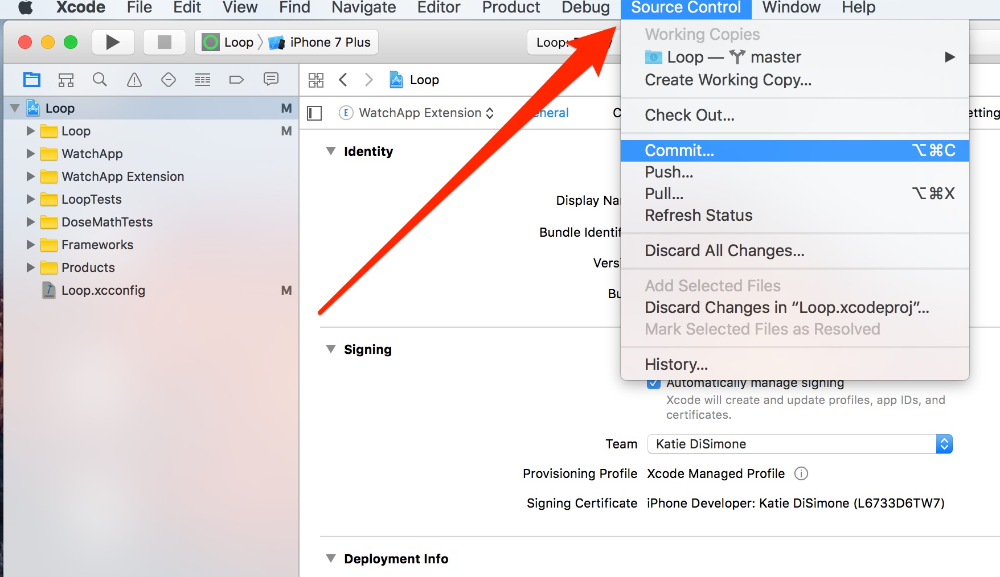

Once you have committed the changes, you will be able to see the changes highlighted in your GitHub desktop client

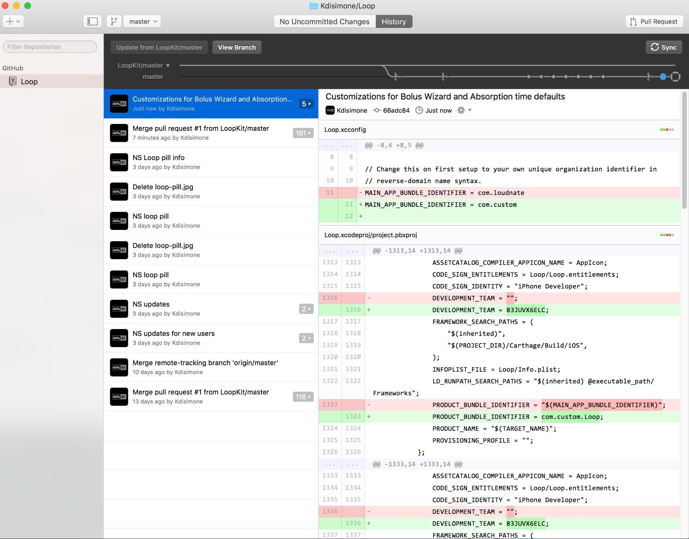

Finally, go to the same Source Control menu in XCode that you just used to “Commit” and this time choose “Push”.  This will push your code customizations up to your GitHub repository.  You can confirm this by finding the Loop.xcconfig file and looking at the MAIN_APP_BUNDLE_IDENTIFIER.  It should no longer say `com.loopkit`.

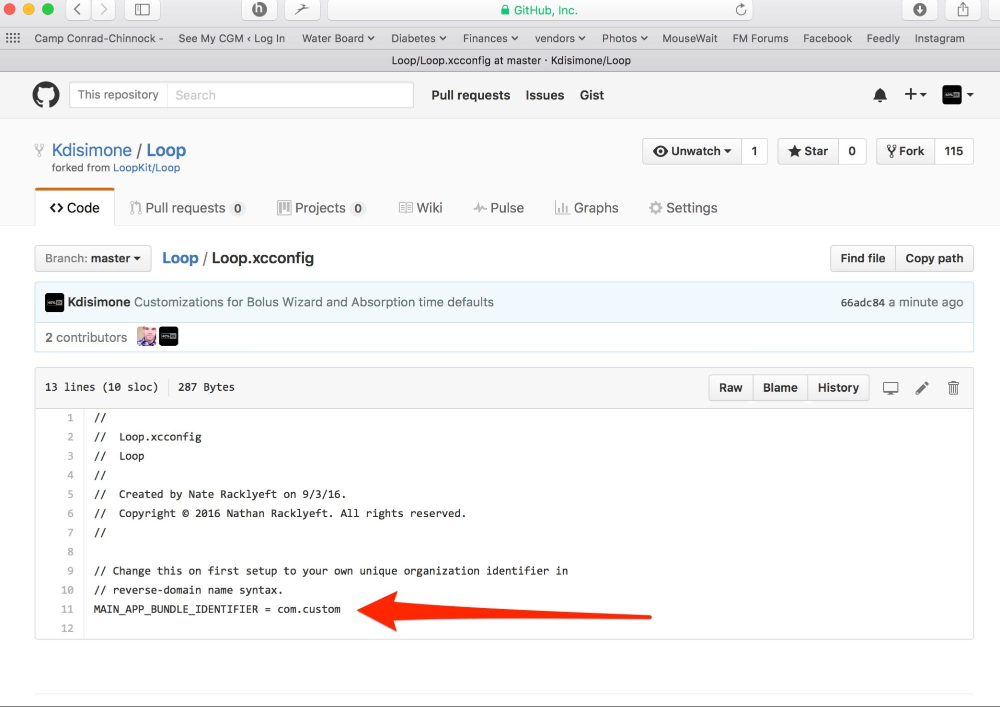
