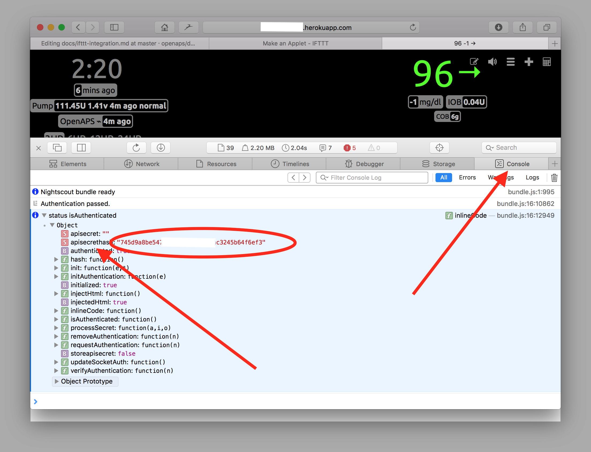
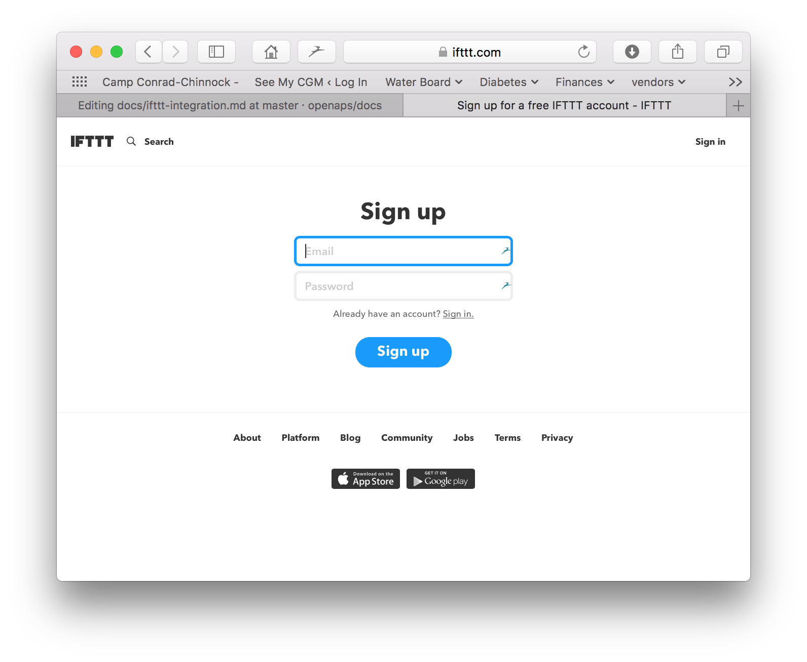
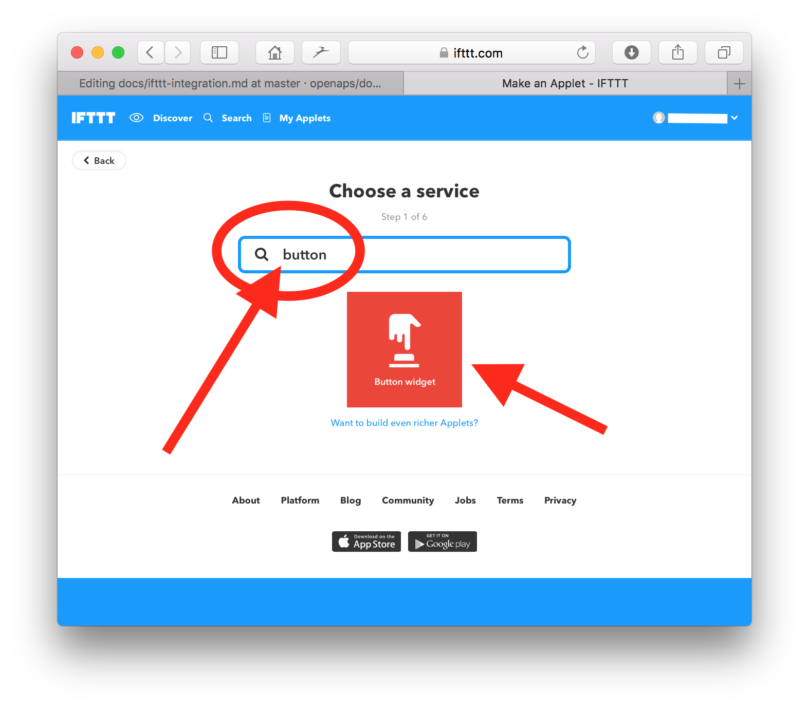

# IFTTT Integration

If This, Then That (IFTTT) is a useful Nightscout integration.  By using IFTTT, you can have single button presses that you can deploy from your iPhone to put a note in your NS site, enter low treatments, log a site change, or log a sensor change. 


## IFTTT Setup for phones

* First we need to gather one thing called your "hashed API Secret". In your internet browser, open a console window while viewing your Nightscout site.  Make sure you have "authenticated" your site by using your API secret in the Nightscout settings area (hint: if you see a little padlock in the upper left corner of the site, you haven't authenticated it).  Refresh the site and your hashed secret key will be shown as "apisecrethash: "xxxxxxxxxx...""  For Safari users on Mac, you can open the console window by selecting "Develop" from the Safari top menu, and then "Show Page Source" (if you do not see "Develop" in the top menu, activate it by going to Safari > Preferences... > Advanced, and checking the "Show Develop menu in menu bar" option).  If you're having problems seeing the apisecrethash, click the little grey triangle next to the "status isAuthenticated" line and the objects below it will display (see screenshot).  Your hashed API secret can be copied and pasted from that line, as shown below.  Save that somewhere easy to get to again, because you will be using it later.



* Get an [IFTTT account](https://ifttt.com/join) 



* Login to your IFTTT.com account and select the "New Applet" button.


* In the screen that appears, click on the blue "+this" part of the screen


* In the next screen, type "button" in the search field and then click on the red box labelled "ButtonWidget"



* Connect the buttonwidget by clicking on the large red "connect" button (You will only have to "connect" the widgets for the first applet you make.  After that the widgets will already connected to your IFTTT account.)


* Click on the large red "button press" box 


* Click on the blue "+that" text


* Enter "maker" in the search field and click on the Maker app


* Connect the Maker app


* Select the grey "Make a Web Request" box


*  Now you will have a blank web request template to complete.  


The following info should be filled in:

URL: https://yoursite.herokuapp.com/api/v1/treatments.json (change the "yoursite" part to your NS info)

Method: POST

Content Type: application/json

Body:  The content of the body will depend on the action that you would like this particular button press to perform.  You can only do ONE of the actions per button.  Some sample content:

Note
```
{"enteredBy": "IFTTT-button", "eventType": "Note", "notes": "Hi mom, I love you!", "secret": "your_hashed_api_goes_here!!!"}
```
Low Treatment
```
{"enteredBy": "IFTTT-button", "reason": "low treatment", "carbs": 15, "secret": "your_hashed_api_goes_here!!!"}
```
Pump Site Change
```
{"enteredBy": "IFTTT-button", "eventType": "Site Change", "duration": 0, "secret": "your_hashed_api_goes_here!!!"}
```
CGM Sensor Start
```
{"enteredBy": "IFTTT-button", "eventType": "Sensor Start", "duration": 0, "secret": "your_hashed_api_goes_here!!!"}
```

* Click the "Create Action" button on the bottom of the screen when you finish.


* Now is your chance to change the title of your Applet now to something meaningful.  You can turn on notifications, too, using the slider shown.  If you turn on the notifications, you will get an alert on your phone and pebble watch when the button press has been successfully deployed.  Finish the IFTTT button by clicking on the Finish button that appears.  


* Repeat the setup for New Applets for as many automated actions as you would like to setup.


## Enable IFTTT in your Nightscout site

* Find your Maker Key by going to your IFTTT account, Services and then clicking on Maker, then Maker settings.


* You will see your Maker Key as the last part of the URL; copy and paste that last part (the red underlined part as shown)


* Login to your Nightscout site host (azure or heroku) and (1) add your Maker Key to the MAKER_KEY line and (2) add "maker" to your ENABLE line.


## Install IFTTT app on your iPhone/Android

* Download the IFTTT app on your phone and log in.

* You can add homescreen quick buttons.  Click on your IFTTT app and login, click on My Applets in the bottom right corner, and then click on the applet that you'd like to work with.  From the the middle of the applet, click on the Widget Settings, and then click on the Add button for the Homescreen Icon.


* For iPhone users, if you downswipe from the top of your iPhone screen, you will have the Today view or Notifications showing.  They are separate pages; Today view is on the left, Notifications is on the right.  You can left/right swipe to go between them.  Go into the Today view and scroll to the bottom, click "edit". This should show a list of existing widgets, followed by a list of "more widgets" with green + signs.  Click on the IFTTT's green circle and the widget will be moved to the top, active widgets area.  You can hold your finger on the three left lines of the IFTTT widget row to drag it to the top of your widget panel, if you prefer to have it as the top-most widget. 


If you end up with more than four IFTTT applets, they will appear in reverse-order of when they were created...which may not be the same as you'd prefer them to appear on your widget bar.  If you'd like to reorder them:

  * go into your iPhone's IFTTT app
  * click on My Applets
  * click on the gear icon in upper left of screen
  * click on Widgets
  * click on the pencil icon in upper right of screen
  * click and hold the three lines that appear on the right side of the widget that you want to move.  Drag the widget to the order in the list that you'd like it to appear in your widget quickscreen.

## Alexa integration
* Since you have IFTTT/Maker requests working, you can get it to work with anything that supports IFTTT, including Alexa. You will need to add "alexa" to your ENABLE line in your Nightscout host settings (azure) or config vars (heroku).  And then repeat the steps above, but instead of using "ButtonWidget" service we started with earlier (the "+if" part of the setup)...you will use the "AmazonAlexa" service.

  
  * Alexa requests do not need underscores, FYI.
