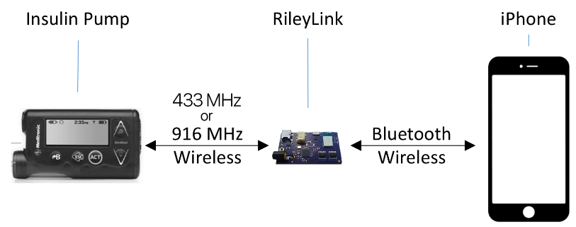

## RileyLink

The RileyLink (RL) is an open-source hardware device that can bridge Bluetooth Low Energy (BLE) to 916MHz wireless communication. What does that mean to you? It means RileyLink is the communication highway between your insulin pump, CGM, and iPhone.

**Loop will not work without the RileyLink.**

The RileyLink is available as a set of PCB files and software, with instructions on how to build your own RileyLink hardware module.  All this can be found here: [RileyLink Github](https://github.com/ps2/rileylink)
If you aren’t up to the task of building your own RileyLink (and most of us aren’t), community members coordinate periodic production runs of RileyLinks. You can place an order here: [RileyLink order site](https://getrileylink.org)

### Assembling RileyLink

Your RileyLink will come with the battery disconnected and the parts not already inside the case.  It will be up to you to put the RileyLink in the case and attach the battery.

Make sure the lipo battery is well-plugged into the connection.  Line up the little ridge appropriately, and push fairly firmly to get the connection tight.  Poor battery cable connection can make the Loop communications fail.  See photos below, for example.

!!!info ""
    The most common two errors for new RileyLink owners are (1) not fully pushing in the lipo battery cable connection and (2) failing to charge the RileyLink.  Compare your lipo battery cable with the photos shown and remember to charge your RileyLink each night.

<figure align="center">

<figcaption>RileyLink with loose battery cable.</figcaption>
</figure>

<figure align="center">

<figcaption>RileyLink with properly secured battery cable.</figcaption>
</figure>

Finally, the board and the battery fit into the slim case fairly tightly as well.  Click on the image below to watch a helpful [assembly video](https://www.youtube.com/watch?v=-GHxxEJMCZc&feature=youtu.be).

### Waiting for RileyLink

Yes, waiting for RileyLink to arrive is extremely difficult if they are backorder.  PLEASE be patient, since Loop CANNOT work without RileyLink.

If you're really dying to do something while RileyLink ships, consider these things below.

FIRST AND FOREMOST:  Get used to Medtronic pump and start using it before Loop.  Sometimes switching pumps will lead to a change in your settings (basals, boluses, etc) simply by the way the new cannula delivers insulin.  It's a great idea to use your Medtronic pump and sets before you ever begin Loop so that you can have one less variable when you do start looping.  At least you can check if you need to adjust basals or other settings when you change to Medtronic pumping.  The same tips apply for Dexcom.  If you are new to Dexcom, start using it before Loop.  Get  familiar with things like compression lows, sensor variability, and calibration timing before Loop use.

But, if you're familiar with your Medtronic pump and Dexcom, here are some ideas:

1.  Program your pump with your basal patterns
2.  Enter the other pump settings required for Loop to work
3.  Update your iPhone iOS, if needed
4.  Update your computer's macOS, if needed
5.  Update your Apple Watch's watchOS, if needed
6.  Download Xcode from the Apple App Store on your Apple computer (**this takes more time than you'd expect, it is a large download**)
7.  Sign up for a Developer Account.  Confirm your enrollment by checking your email afterwards.
8.  Install Homebrew on your computer
9.  Download Loop source code and get started with Loop building
10. Make customizations, if desired
11. Build Loop app onto your iPhone
12. Fill in the pump settings in your Loop app
13. Set up a Nightscout site or update your existing site (optional)
14. Bookmark the LoopDocs page for future reference
15. Join [Gitter Loop channel](https://gitter.im/LoopKit/Loop) and/or [the Looped Facebook Group](https://www.facebook.com/groups/TheLoopedGroup/?fref=nf)

BUT, then you must wait.  **You can't go any further with Loop operations until you get the RileyLink.**  However, if you do all those things above while you wait...you will be ready to go as soon as the postman knocks on your door with the delivery.
